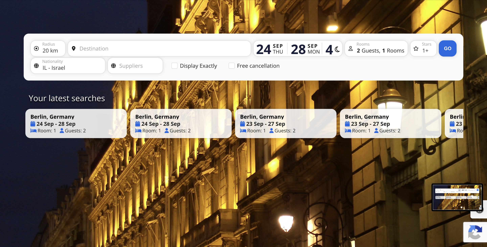
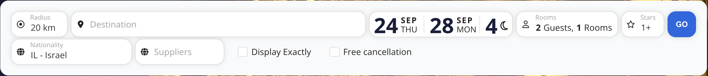
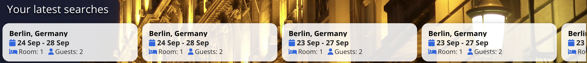

# 1. Hotel Search

How to start a hotel search: the search form and your latest searches.

## Contents

1. [Search Form](#1-search-form)
   - [Search Bar on the Results Page](#11-search-bar-on-the-results-page)
2. [Your Latest Searches](#2-your-latest-searches)

---

The start screen opens after login. It contains the search form and your latest searches.

## 1. Search Form

Fill in the fields and click **GO** to start the search. Every change to these fields requires clicking **GO** again.

| Field | Description | Default |
|---|---|---|
| **Radius** | Search radius around the destination point. Only hotels within this distance are returned. | The radius from your last search |
| **Destination** | City, address, or a specific hotel. Start typing and choose from the list. If the destination can't be found, an error message is shown and the search does not start. | Empty (required) |
| **Check-in / Check-out** | Stay dates. The number of nights 🌙 is calculated automatically. | Today → 4 nights later |
| **Rooms** | Number of rooms and guests per room. | 2 Guests, 1 Room |
| **Stars** | Minimum hotel star rating. `1+` means 1 star and above. | Your saved setting (3 if not set) |
| **Nationality** | Guest's nationality. Prices and availability can vary by nationality, so it should match the guest's passport. | From your profile |
| **Suppliers** | Limits the search to selected suppliers. If empty, all suppliers are searched. Visible only for specific branches. | Empty (all suppliers) |
| **Display Exactly** | Searches only inside the boundaries (polygon) of the destination locality. Hotels outside the locality are not shown, even if they are within the radius. | Off |
| **Free cancellation** | Returns only offers with free cancellation. Other offers are not loaded at all. To filter already loaded results instead, use the **Free** toggle in the toolbar (see [Quick Toggles](Hotels-Guide-2-Results#12-quick-toggles)). | Off |
| **GO** | Runs the search. | — |

### 1.1 Search Bar on the Results Page

On the results page, the same search form is shown in a compact form at the top. The fields work as described above. Two extra buttons are available:

| Button | Description |
|---|---|
| **New search** | Resets all search parameters and filters and starts a fresh search. |
| **Expand (⌄ / ⌃)** | Shows or hides the second row: Nationality, Suppliers, Display Exactly, Free cancellation. |

---

## 2. Your Latest Searches

Your recent hotel searches are shown under the search form, newest first. Each card shows the destination, dates, number of rooms and guests.

Click a card to run that search again.

---

[Guide home](Hotels-Guide) | [2. Search Results](Hotels-Guide-2-Results) →
