# Hotel Search — Filters Documentation

This document describes every search and filter control available on the hotel search results page.

## Table of Contents

1. [Search Bar](#1-search-bar)
   - [Advanced Search Options](#11-advanced-search-options)
2. [Filter Toolbar](#2-filter-toolbar)
   - [View & Sorting](#21-view--sorting)
   - [Quick Toggles](#22-quick-toggles)
   - [Meal Plans](#23-meal-plans)
   - [Star Rating](#24-star-rating)
   - [Location & Distance](#25-location--distance)
   - [Additional Controls](#26-additional-controls)
3. [Sidebar](#3-sidebar)
   - [Sidebar Tabs](#31-sidebar-tabs)
   - [Search Filters](#32-search-filters)
   - [Hotel Facilities](#33-hotel-facilities)
4. [Results Tabs](#4-results-tabs)
   - [Room AI](#41-room-ai)
5. [Hotel Card](#5-hotel-card)

---

## 1. Search Bar

The search bar defines the main search parameters. After changing any value, click **GO** to run the search.

| Control            | Description                                                                                                 | Example             |
| ------------------ | ----------------------------------------------------------------------------------------------------------- | ------------------- |
| **New search**     | Resets all search parameters and filters and starts a fresh search.                                         | —                   |
| **Radius**         | Search radius around the destination point. Only hotels within this distance are returned.                  | `2 km`              |
| **Destination**    | City, region, or address to search in.                                                                      | `Berlin, Germany`   |
| **Check-in date**  | Arrival date (day, month, weekday).                                                                         | `23 SEP WED`        |
| **Check-out date** | Departure date.                                                                                             | `27 SEP SUN`        |
| **Nights** 🌙      | Number of nights, calculated automatically from the check-in and check-out dates.                           | `4`                 |
| **Rooms**          | Number of guests and rooms.                                                                                 | `2 Guests, 1 Rooms` |
| **Stars**          | Minimum hotel star rating. `1+` means 1 star and above.                                                     | `1+`                |
| **Expand (⌄ / ⌃)** | Shows or hides the advanced search options. See [1.1 Advanced Search Options](#11-advanced-search-options). | —                   |
| **GO**             | Runs the search with the current parameters.                                                                | —                   |

### 1.1 Advanced Search Options

Click the **Expand (⌄)** button next to **GO** to show a second row with advanced options. Click **Collapse (⌃)** to hide it again.

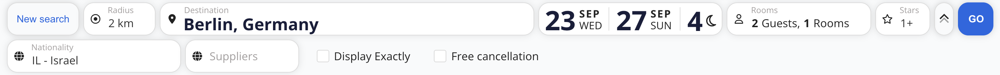

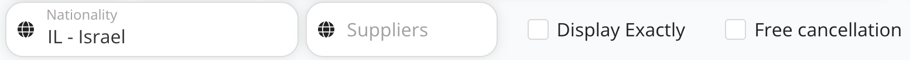

| Control               | Description                                                                                                                                                                                                               | Example       |
| --------------------- | ------------------------------------------------------------------------------------------------------------------------------------------------------------------------------------------------------------------------- | ------------- |
| **Nationality**       | Guest's nationality (country code + name). Prices and availability can vary by nationality, so this should match the guest's passport.                                                                                    | `IL - Israel` |
| **Suppliers**         | Limits the search to selected suppliers (rate providers). If empty, all suppliers are searched.                                                                                                                           | —             |
| **Display Exactly**   | When checked, hotels are searched only inside the boundaries (polygon) of the destination locality. Hotels outside the locality are not shown, even if they are within the search radius.                                 | —             |
| **Free cancellation** | When checked, the search returns only offers with free cancellation. Other offers are not loaded at all. To filter already loaded results instead, use the **Free** toggle in the toolbar (see [2.2](#22-quick-toggles)). | —             |

> **Tip:** Advanced options are part of the search itself, so click **GO** after changing them. Toolbar filters (section 2) only refine results that were already loaded.

---

## 2. Filter Toolbar

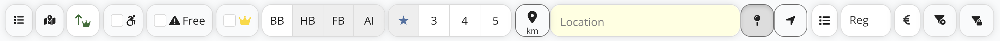

The toolbar refines the current results. Filters apply on top of the search parameters from the search bar.

### 2.1 View & Sorting

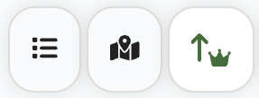

| Control       | Description                                                                                                                  |
| ------------- | ---------------------------------------------------------------------------------------------------------------------------- |
| **View mode** | Opens the view mode menu. Selects how hotels and room offers are displayed in the list. See [View modes](#view-modes) below. |
| **Map view**  | Shows results as markers on a map.                                                                                           |
| **Sort**      | Opens the sort menu. The button icon shows the currently selected sort order. See [Sort options](#sort-options) below.       |

#### View modes

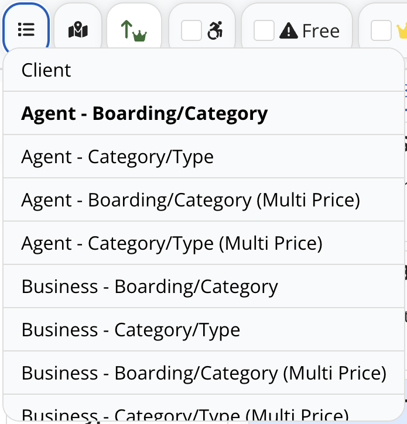

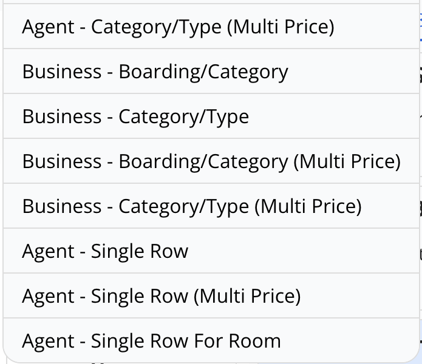

Click the **View mode** button to choose how results are displayed. The selected mode is shown in bold.

View modes let you show or hide hotel photos and display room offers in different ways (for example, grouped by boarding and category, or by category and type, with one or several prices).

Available modes:

- Client
- Agent - Boarding/Category
- Agent - Category/Type
- Agent - Boarding/Category (Multi Price)
- Agent - Category/Type (Multi Price)
- Business - Boarding/Category
- Business - Category/Type
- Business - Boarding/Category (Multi Price)
- Business - Category/Type (Multi Price)
- Agent - Single Row
- Agent - Single Row (Multi Price)
- Agent - Single Row For Room

#### Sort options

Click the **Sort** button to open the menu, then choose an option. The selected option is highlighted, and its icon is shown on the Sort button. A green ↑ arrow means ascending order, a red ↓ arrow means descending order.

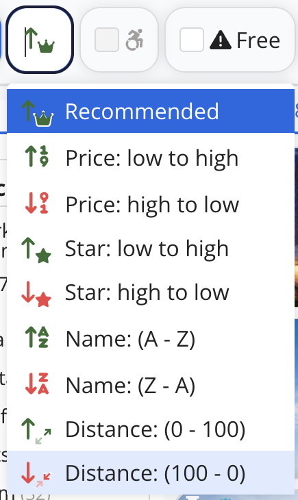

| Option                    | Description                                                                                                               |
| ------------------------- | ------------------------------------------------------------------------------------------------------------------------- |
| **Recommended** (default) | Preferred hotels (👑) are shown first. All hotels are then sorted by price, from low to high.                             |
| **Price: low to high**    | Cheapest offers first.                                                                                                    |
| **Price: high to low**    | Most expensive offers first.                                                                                              |
| **Star: low to high**     | Lowest star rating first.                                                                                                 |
| **Star: high to low**     | Highest star rating first.                                                                                                |
| **Name: (A - Z)**         | Alphabetical order by hotel name.                                                                                         |
| **Name: (Z - A)**         | Reverse alphabetical order by hotel name.                                                                                 |
| **Distance: (0 - 100)**   | Nearest hotels first (from the city center, or from the point selected in [Location & Distance](#25-location--distance)). |
| **Distance: (100 - 0)**   | Farthest hotels first.                                                                                                    |

### 2.2 Quick Toggles

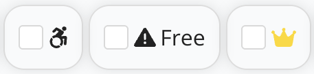

Each toggle is a checkbox. When checked, only hotels matching that condition are shown.

| Control              | Description                                                                                                                                   |
| -------------------- | --------------------------------------------------------------------------------------------------------------------------------------------- |
| ♿ **Accessibility** | Shows only wheelchair-accessible hotels / rooms.                                                                                              |
| ⚠️ **Free**          | Free cancellation filter for the loaded results. First click: shows only offers with free cancellation. Second click: shows all offers again. |
| 👑 **Crown**         | Shows only preferred / featured hotels (marked with a crown on the hotel card).                                                               |

### 2.3 Meal Plans

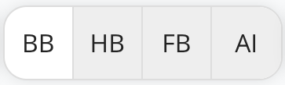

Filters offers by board type. Multiple options can be selected.

| Code   | Meaning         | Included                                |
| ------ | --------------- | --------------------------------------- |
| **BB** | Bed & Breakfast | Breakfast                               |
| **HB** | Half Board      | Breakfast + dinner                      |
| **FB** | Full Board      | Breakfast + lunch + dinner              |
| **AI** | All Inclusive   | All meals, snacks, and (usually) drinks |

### 2.4 Star Rating

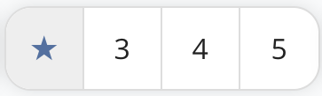

Filters hotels by official star category.

| Control       | Description                                                                       |
| ------------- | --------------------------------------------------------------------------------- |
| ★             | Toggles the star filter / shows all categories.                                   |
| **3 / 4 / 5** | Shows only hotels with the selected star rating. Multiple values can be selected. |

### 2.5 Location & Distance

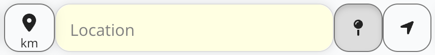

Filters and sorts hotels by distance to a specific point (e.g. an office, venue, or landmark) instead of the city center.

| Control      | Description                                                          |
| ------------ | -------------------------------------------------------------------- |
| 📍 **km**    | Sets the maximum distance (in km) from the selected point.           |
| **Location** | Text field to enter an address or place name as the reference point. |

### 2.6 Additional Controls

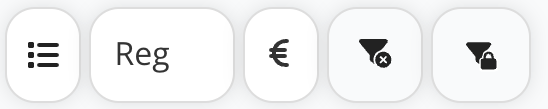

| Control                           | Description                                                                                            |
| --------------------------------- | ------------------------------------------------------------------------------------------------------ |
| **Suppliers**                     | Opens the suppliers summary. See [Suppliers](#suppliers) below.                                        |
| **Reg**                           | Price type selector. Changes which price is shown in the results. See [Price type](#price-type) below. |
| **€ Currency**                    | Changes the currency in which prices are displayed.                                                    |
| **Clear filters** (funnel with ✕) | Removes all active filters and returns to the full result list.                                        |
| **Lock filters** (funnel with 🔒) | Keeps the current filters active for new searches.                                                     |

#### Suppliers

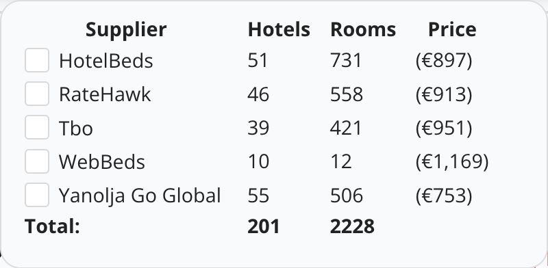

Shows which suppliers returned results for the current search.

| Column       | Description                                                                                                               |
| ------------ | ------------------------------------------------------------------------------------------------------------------------- |
| **Supplier** | Supplier name. Check one or more suppliers to show only their offers.                                                     |
| **Hotels**   | Number of hotels the supplier returned.                                                                                   |
| **Rooms**    | Number of room offers the supplier returned.                                                                              |
| **Price**    | Lowest price offered by the supplier.                                                                                     |
| **Total**    | Total number of hotels and rooms across all suppliers. A hotel offered by several suppliers is counted once per supplier. |

#### Price type

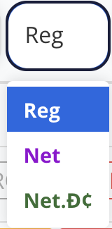

Click the **Reg** button to open the menu and choose the price type. The selected option is shown on the button.

| Option            | Description                                    |
| ----------------- | ---------------------------------------------- |
| **Reg** (default) | Regular price: selling price including markup. |
| **Net**           | Net price: supplier price without markup.      |
| **Net.Đ¢**        | Net price after discount.                      |

---

## 3. Sidebar

### 3.1 Sidebar Tabs

| Tab                   | Description                                                                                        |
| --------------------- | -------------------------------------------------------------------------------------------------- |
| 🛏 **Search filters** | Filters by hotel name, room name, price, hotel type, and room type. See [3.2](#32-search-filters). |
| 🏢 **Hotel**          | Hotel-level filters: **Hotel facilities**. See [3.3](#33-hotel-facilities).                        |
| 🕘 **History**        | Previous searches, which can be reopened.                                                          |
| 🤖 **AI**             | Not available yet (greyed out).                                                                    |

### 3.2 Search Filters

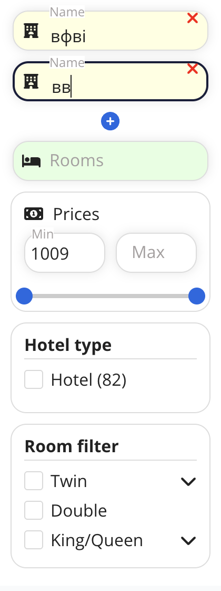

| Filter          | Description                                                                                                                                                                                                |
| --------------- | ---------------------------------------------------------------------------------------------------------------------------------------------------------------------------------------------------------- |
| 🏢 **Name**     | Filters hotels by name. Start typing to see matching hotels. Click **+** to add another name field and search for several hotels at once. Click **✕** to remove a field.                                   |
| 🛏 **Rooms**    | Filters by room name. Only hotels that have a room with a matching name are shown.                                                                                                                         |
| 💵 **Prices**   | Price range for the whole stay. Enter **Min** / **Max** values, or drag the slider handles.                                                                                                                |
| **Hotel type**  | Filters by property type (e.g. Hotel). The number in brackets shows how many properties of that type are in the results.                                                                                   |
| **Room filter** | Filters by room type (e.g. Twin, Double, King/Queen). Options with an arrow (⌄) can be expanded to show sub-types. The list of options depends on the search results, so it changes from search to search. |

### 3.3 Hotel Facilities

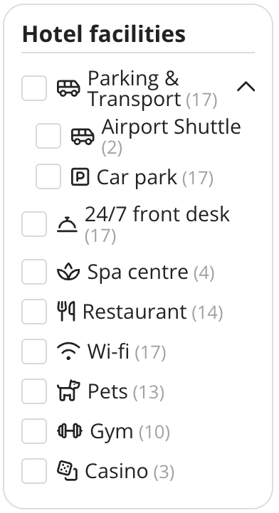

Check one or more facilities to show only hotels that offer **all** of them (AND logic). The number in brackets shows how many hotels in the current results have that facility.

- Some facilities are groups (e.g. **Parking & Transport**). Checking a group selects all its sub-options, and the arrow expands or collapses the group.

---

## 4. Results Tabs

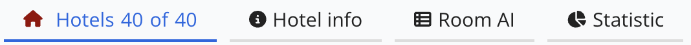

| Tab               | Description                                                                                       |
| ----------------- | ------------------------------------------------------------------------------------------------- |
| **Hotels X of Y** | List of hotels. `X` = hotels matching the active filters, `Y` = total hotels found by the search. |
| **Hotel info**    | Detailed information about the selected hotel.                                                    |
| **Room AI**       | Filters by room attributes recognised by AI. See [4.1](#41-room-ai).                              |

### 4.1 Room AI

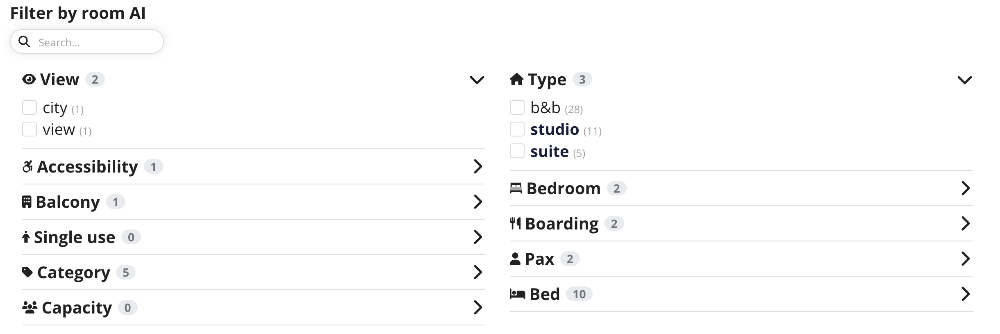

The **Room AI** tab lets you filter rooms by attributes that AI extracts from room names and descriptions (for example view, room type, bed type, board, number of guests).

- Attributes are grouped into categories. The number next to a category shows how many options it contains.
- Click a category (›) to expand it, then check one or more options.
- The number in brackets next to each option shows how many rooms have that attribute.
- Use the **Search** field to find an option quickly.

> **Note:** Categories and options are generated from the rooms found in the current search, so they are different for every search.

---

## 5. Hotel Card

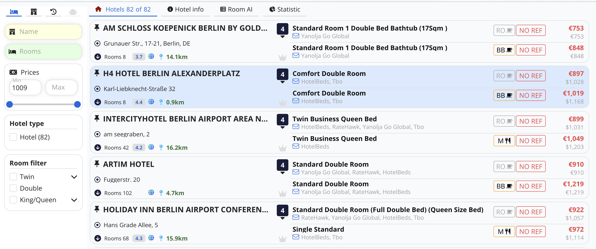

Each hotel in the results is shown as a card. The left part shows hotel information, the right part shows the best room offers.

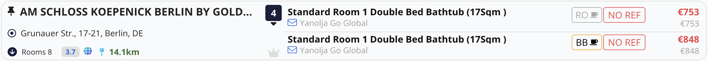

### Hotel information

| Element                      | Description                                                                                                 |
| ---------------------------- | ----------------------------------------------------------------------------------------------------------- |
| 📌 **Pin**                   | Pins the hotel to the top of the list.                                                                      |
| **Hotel name**               | Long names are shortened with "…".                                                                          |
| **Address**                  | Hotel address.                                                                                              |
| **Rooms N**                  | Number of available room offers. Click ⬇ to expand the full list of rooms.                                  |
| **Rating** (e.g. `3.7`)      | Guest review score.                                                                                         |
| 🌐 **Globe**                 | Finds information about this hotel on Google and Tripadvisor.                                               |
| **Distance** (e.g. `14.1km`) | Distance from the city center, or from the point selected in [Location & Distance](#25-location--distance). |
| **Dark badge** (e.g. `4`)    | Hotel star category.                                                                                        |
| 👑 **Crown**                 | Marks preferred / featured hotels. Highlighted when active.                                                 |

### Room offers

| Element                  | Description                                                                                                                                     |
| ------------------------ | ----------------------------------------------------------------------------------------------------------------------------------------------- |
| **Room name**            | Room name as provided by the supplier.                                                                                                          |
| ✉ **Suppliers**          | Suppliers that offer this room at this price (e.g. HotelBeds, RateHawk, Tbo).                                                                   |
| **Meal plan badge**      | Board type included in the price: **RO** – Room Only (no meals), **BB** – Bed & Breakfast, **M** – Meal. See also [Meal Plans](#23-meal-plans). |
| **NO REF**               | Non-refundable offer: no refund if the booking is cancelled. Offers with free cancellation do not show this badge.                              |
| **Price** (red, top)     | Total price for the whole stay, in the selected currency.                                                                                       |
| **Price** (grey, bottom) | Original supplier price, in the supplier's currency (e.g. `$1,028`).                                                                            |
